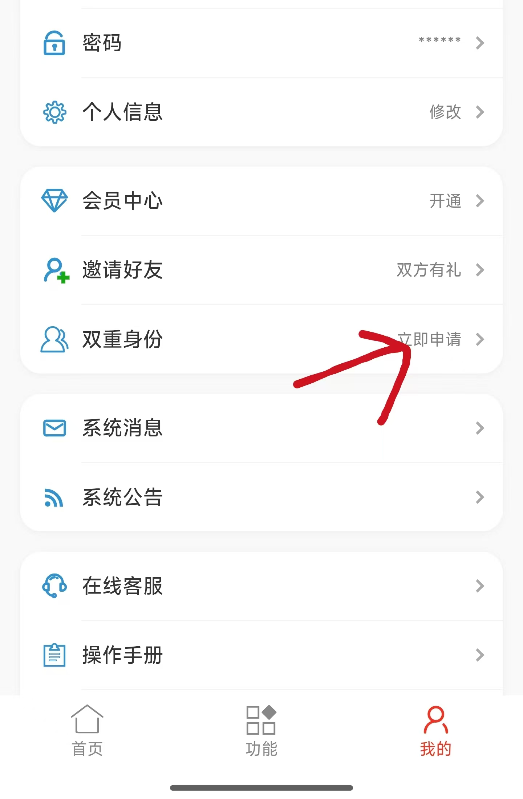

# 对分易自动签到

对分易自动签到工具，支持二维码签到、签到码签到、定位签到。

## 如何开启教师模式

使用前需先在微信小程序"对分易"中切换为教师模式，操作步骤如下：

**步骤一**：打开对分易微信小程序 → 进入"我的"页面 → 点击"双重身份" → 点击"立即申请"。



**步骤二**：申请通过后，进入"双重身份"页面 → 点击"切换为老师"按钮，即可完成切换。


## 功能

- 微信链接登录 / 账号密码登录
- 自动监听课程签到活动
- 支持签到码（4位）、二维码、定位三种签到方式
- 可自定义提前签到秒数

## 下载

### 方式一：Git 克隆
```bash
git clone https://github.com/guanalysia-ux/duifene-auto-sign.git
cd duifene-auto-sign
```

### 方式二：下载 ZIP
点击页面右上角绿色 **Code** 按钮 → **Download ZIP**，解压即可。

## 运行

```bash
pip install -r requirements.txt
python main.py
```

## 打包 exe（可选）

```bash
pip install pyinstaller
pyinstaller --onefile --windowed --name duifene_sign main.py
```

打包后的 exe 在 `dist/` 目录下。
